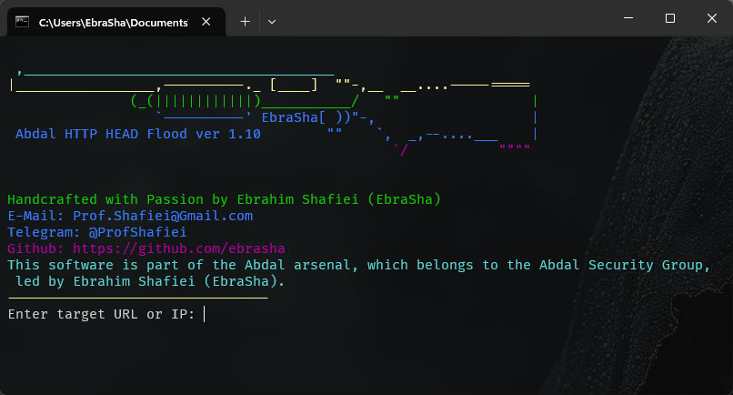

# 🔥 ابزار حملات HEAD Flood ابدال

  

این نرم‌افزار بخشی از زرادخانه ابدال است که متعلق به گروه امنیتی ابدال به رهبری ابراهیم شفیعی (EbraSha) می‌باشد.

یک ابزار تست HTTP HEAD flood با کارایی بالا و قابل تنظیم که با **Rust** نوشته شده است.  
طراحی شده برای تحقیقات امنیت سایبری، تست استرس شبکه و معیارهای عملکرد.

## 🎙️ ترجمه

[English](README.md) | [فارسی](README.fa.md)

---

## ⚙️ ویژگی‌ها

- ⚡ **موتور ناهمگام با کارایی بالا** با استفاده از [`tokio`] و [`reqwest`]
- 🧠 **هدرهای کاملاً قابل تنظیم**:
  - `User-Agent` جعل مروگر و هویت واقعی مهاجم
  - `Referer` جعل ارجاع دهنده
  - `Host` جعل بخش هاست
  - `Connection` برای ایجاد فشار بیشتر
  - `X-Forwarded-For`, `Client-IP` برای جعل آی پی
- 🎯 **تعیین هدف**:
  - نام دامنه یا آدرس IP
  - پشتیبانی از HTTP/HTTPS
- 📥 **رابط خط فرمان تعاملی**
  - راهنمایی کاربرپسند
  - حداقل تایپ (انتخاب مبتنی بر منو)
- 🎨 **بنر ASCII با سبک سایبرپانک** با رنگ‌های ترمینال
- 🔄 **اجرای موازی چند نخی**
- 🔍 **ثبت دقیق** (ثبت اختیاری درخواست‌ها)
- 🧪 طراحی شده برای **تیم قرمز**، **تست استرس** و **تحلیل دفاعی**
- ✅ این ابزار به‌طور کامل **چندسکویی** است و بدون هیچ مشکلی روی **ویندوز (Windows)**، **لینوکس (Linux)** و **مک‌اواس (macOS)** اجرا می‌شود.
---

## 🧩 نحوه استفاده

حالت تعاملی شما را در موارد زیر راهنمایی می‌کند:
- وارد کردن هدف (IP/URL)
- تعداد کل درخواست‌ها
- تعداد نخ‌ها (همزمانی)
- فعال/غیرفعال کردن گزارش‌های هر درخواست
- گزینه‌های جعل IP
- تنظیم هدرها (User-Agent, Host, Referer, Connection)

---

## 🧠 معماری

- نوشته شده با **Rust** خالص
- استفاده از `tokio` برای همزمانی ناهمگام
- ارسال‌کننده درخواست چند نخی
- منطق تولید هدر تصادفی با استفاده از `rand`
- طراحی ماژولار: به راحتی قابل گسترش

---

## 📦 وابستگی‌ها

- [`reqwest`](https://crates.io/crates/reqwest)
- [`tokio`](https://crates.io/crates/tokio)
- [`rand`](https://crates.io/crates/rand)
- [`colored`](https://crates.io/crates/colored) – برای هنر ترمینال
- `std::io`, `std::sync::Arc`, `std::time::Duration`

## ⚠️ هشدار استفاده اخلاقی
این ابزار فقط برای **تست امنیتی قانونی و اخلاقی** طراحی شده است. همیشه:
- قبل از تست هر وب‌سایت، مجوز مناسب را دریافت کنید
- شیوه‌های افشای مسئولانه را دنبال کنید
- به قوانین حفظ حریم خصوصی و محافظت از داده‌ها احترام بگذارید
- از این ابزار فقط روی سیستم‌هایی که مجاز به تست آنها هستید استفاده کنید

## 🐛 گزارش مشکلات
اگر با مشکلی مواجه شدید یا در پیکربندی مشکل دارید، لطفاً از طریق ایمیل Prof.Shafiei@Gmail.com با ما در تماس باشید. همچنین می‌توانید مشکلات را در GitLab یا GitHub گزارش دهید.

## ❤️ حمایت مالی
اگر این پروژه برای شما مفید بود و مایل به حمایت از توسعه بیشتر هستید، لطفاً در نظر داشته باشید که کمک مالی کنید:
- [اینجا اهدا کنید](https://alphajet.ir/abdal-donation)

## 🤵 برنامه‌نویس
ساخته شده با عشق توسط **ابراهیم شفیعی (EbraSha)**
- **ایمیل**: Prof.Shafiei@Gmail.com
- **تلگرام**: [@ProfShafiei](https://t.me/ProfShafiei)

## 📜 مجوز
این پروژه تحت مجوز GPLv2 or later منتشر شده است. 